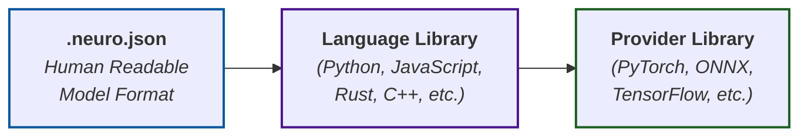

# NeuroFormat Schema

A unified JSON schema system for describing neural network models as hierarchical node graphs.

## Overview

NeuroFormat introduces the **NeuroGraph** format - a human-readable, framework-agnostic approach to neural network model representation that differs from existing serialized formats.
**NeuroGraph** aims to provide an agnostic abstraction defining the structure of AI models, where models are written once in human-readable form and deployed everywhere through a unified ecosystem of language and provider libraries.

### What Makes NeuroGraph Different

**🖊️ Human-Readable & Editable**  
Unlike binary or complex serialization formats, NeuroGraph uses clean JSON that model authors can write, read, and edit directly without specialized tools.  
No more wrestling with export scripts or format-specific APIs - just define your model structure in JSON.  

**🌐 Language & Provider Agnostic Architecture**  
NeuroGraph employs a two-layer abstraction system:

1. **Language Libraries**: Each programming language (Python, JavaScript, Rust, C++, etc.) has its own implementation package that reads `.neuro.json` files into native in-memory node-graph representations
2. **Provider Libraries**: Specific compute providers (PyTorch, LibTorch, ONNX Runtime, TensorFlow, etc.) have dedicated packages that translate the node-graph representation into provider-specific execution instructions

This separation means you write your model once in NeuroGraph, then deploy it anywhere without format conversion hassles.

**⚡ Direct Model Authoring**  
Instead of being an export target, *NeuroGraph* is designed as a primary authoring format. Model developers can define their architectures directly in `.neuro.json` files, making model sharing, version control, and collaboration as simple as sharing a text file.  

## Design Goals

NeuroGraph prioritizes human-centric development over serialization efficiency:

- **🖊️ Human Authoring**: Write and edit models directly in JSON without specialized tools
- **📖 Readability**: Clear structure that developers can understand at a glance  
- **🔗 Universal Deployment**: Language-agnostic format with provider-specific translation layers
- **📝 Version Control Friendly**: Text-based format that works seamlessly with Git
- **🔄 Modularity**: Reusable components across models, languages, and frameworks
- **🔧 Extensibility**: Custom and third-party components via namespacing
- **⚡ Rapid Prototyping**: Quick iteration without framework lock-in

## Getting Started

1. **Explore Examples**: Check the `docs/examples/` directory for complete model definitions
2. **Validate Models**: Use JSON Schema validators with the provided `.schema.json` files  
3. **Reference Schema Version**: Include the `$schema` field in your `.neuro.json` files for validation and tooling support
4. **Build Language Libraries**: Implement parsers for your preferred programming language
5. **Create Provider Libraries**: Add support for your compute framework (PyTorch, TensorFlow, etc.)
6. **Extend the Schema**: Add custom operators, layers, or architectures using namespacing

## Library Hierarchy



## NeuroGraph Concepts

### Hierarchical Node Composition

The NeuroGraph format is built around a simple concept: **everything is a node**.
Nodes can be composed hierarchically to create increasingly complex structures:

- **Operators** (Atomic nodes): Basic mathematical operations like `add`, `multiply`, `matmul`, `relu`
- **Layers** (Compound nodes): Neural network components like `linear`, `convolution`, `attention`
- **Architectures** (Compound nodes): High-level patterns like `sequential`, `transformer`, `resnet`

### Unified Structure

All nodes, regardless of complexity, follow the same structural pattern:

```json
{
  "name": "node_name",
  "type": "node_type", 
  "parameters": {
    "inputs": [/* input specifications */],
    "attributes": {/* node-specific parameters */}
  },
  "implementation": {
    "subgraph": [/* internal node composition */],
    "weights": "/* optional weight data */"
  }
}
```

This unified approach enables:

- **Modularity**: Reusable component definitions
- **Composability**: Nodes can contain other nodes recursively
- **Extensibility**: Third-party components via `namespace:type` syntax
- **Consistency**: Same validation and tooling for all abstraction levels

## File Structure

A `.neuro.json` file contains these sections:

### 📋 `metadata` (Required)

Defines model information and configuration:

**Key fields:**

- **Core metadata**: `name`, `version`, `description`, `author`, `license`
- **Constants**: Immutable model properties (e.g., `input_channels: 3`)
- **UI configuration**: Display settings, icons, prompting guidelines
- **Third-party sections**: Custom metadata for external tools

#### Example

```json
{
  "metadata": {
    "model": {
      "name": "example_model",
      "version": "1.0.0", 
      "description": "Model description",
      "author": "Author Name",
      "license": "MIT",
      "tags": ["classification", "cnn"]
    }
  }
}
```

### 🔌 `inputs` (Required)

Defines the input tensors the model expects:

```json
{
  "inputs": [
    {
      "name": "image",
      "description": "RGB image input",
      "shape": [3, 224, 224],
      "dtype": "float32"
    }
  ]
}
```

### 🔍 `outputs` (Required)

Defines the output tensors the model produces:

```json
{
  "outputs": [
    {
      "name": "predictions",
      "description": "Class probabilities", 
      "shape": [1000],
      "dtype": "float32"
    }
  ]
}
```

### 🎯 `export` (Required)

The main execution graph - defines how the model processes inputs to produce outputs:

```json
{
  "export": [
    {
      "name": "classifier",
      "type": "resnet50",
      "arguments": ["image"]
    }
  ]
}
```

### 🔧 `definitions` (Optional)

Reusable node definitions for operators, layers, and architectures:

```json
{
  "definitions": [
    {
      "name": "my_sequential_classifier",
      "type": "sequential",
      "parameters": {
        "inputs": [{"name": "input", "type": "tensor"}]
      },
      "implementation": {
        "subgraph": [
          {"name": "fc1", "type": "linear", "arguments": ["input"]},
          {"name": "relu1", "type": "activation", "arguments": ["fc1"]},
          {"name": "output", "type": "linear", "arguments": ["relu1"]}
        ]
      }
    }
  ]
}
```

### Node References

NeuroGraph uses a simple string-based system for referencing nodes within a model:

- **Simple names**: `"image"`, `"fc1"`, `"relu1"` - Reference inputs, local nodes, or definitions by name
- **Path notation**: `"module/subnode"` - Reference nested nodes using forward-slash paths  
- **Definition references**: `"my_classifier"` - Reference custom definitions declared in the `definitions` section

Examples of node references in use:

```json
{
  "export": [
    {"name": "main", "type": "my_classifier", "arguments": ["image"]}
  ],
  "definitions": [
    {
      "name": "my_classifier",
      "implementation": {
        "subgraph": [
          {"name": "fc1", "type": "linear", "arguments": ["input"]},
          {"name": "output", "type": "activation", "arguments": ["fc1"]}
        ]
      }
    }
  ]
}
```

This consistent referencing system works across all contexts - whether connecting nodes in a subgraph, referencing inputs, or using custom definitions.

## Schema Architecture

The NeuroFormat schema system is modular and extensible:

### Core Schemas

- **`neuro.schema.json`**: Main schema defining file structure and base node types
- **`operators.schema.json`**: Mathematical operators (add, multiply, matmul, etc.)
- **`layers.schema.json`**: Neural network layers (linear, convolution, attention, etc.)
- **`architectures.schema.json`**: High-level architectures (sequential, transformer, etc.)

### Type System

The schemas use concise "catchall" type definitions to reduce redundancy:

- **`anyint`**: Any signed integer type (`int8`, `int16`, `int32`, `int64`)
- **`anyuint`**: Any unsigned integer type (`uint8`, `uint16`, `uint32`, `uint64`)  
- **`anyfloat`**: Any floating-point type (`float16`, `float32`, `float64`)
- **`anynumeric`**: Any numeric type (combination of above)

### Extensibility

Third-party extensions are supported through namespaced types:

```json
{
  "type": "mycompany:custom_operator",
  "attributes": {
    "custom_parameter": "value"
  }
}
```

## Complete Example

### Simple Sequential Classifier

```json
{
  "$schema": "https://raw.githubusercontent.com/neuro-format/schemas/2025-1/neuro.schema.json",
  "metadata": {
    "model": {
      "name": "mnist_classifier",
      "version": "1.0.0",
      "description": "Simple MNIST digit classifier"
    }
  },
  "inputs": [
    {"name": "image", "shape": [1, 784], "dtype": "float32"}
  ],
  "outputs": [
    {"name": "predictions", "shape": [1, 10], "dtype": "float32"}
  ],
  "definitions": [
    {
      "name": "classifier", 
      "type": "sequential",
      "parameters": {
        "inputs": [{"name": "input", "type": "tensor", "shape": [784]}]
      },
      "implementation": {
        "subgraph": [
          {"name": "fc1", "type": "linear", "arguments": ["input"]},
          {"name": "relu1", "type": "activation", "arguments": ["fc1"]},
          {"name": "fc2", "type": "linear", "arguments": ["relu1"]},
          {"name": "output", "type": "activation", "arguments": ["fc2"]}
        ]
      }
    }
  ],
  "export": [
    {"name": "main", "type": "classifier", "arguments": ["image"]}
  ]
}
```

For complete examples, see the `docs/examples/` directory.
